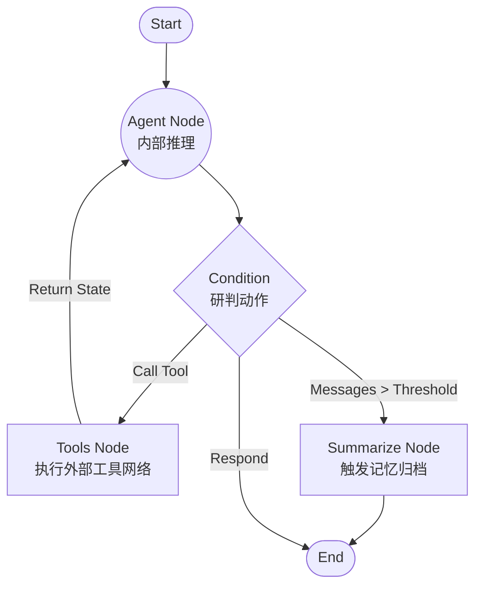

# LangGraph Agent

本项目是一个基于 LangGraph 的 Agent 架构实现示例，主要用于构建多轮对话的常驻服务，并集成了必要的持久化与工具调度功能。

## 🌟 核心功能

- **用户鉴权与会话隔离**：基于 FastAPI 的 OAuth2PasswordBearer 与 JWT 实现用户登录。在底层依赖传递时绑定用户状态，以实现不同用户的 Checkpointer 历史会话隔离跨端追踪。
- **流式多轮对话支持**：核心对话接口 (`/chat/stream`) 基于 Server-Sent Events (SSE) 和 LangGraph V2 的 `astream_events` 实现，能够实时返回 LLM 的 Token 输出及内部 Tool 的调用细节。
- **长短协作会话记忆**：项目基于 LangGraph 的 Checkpointer 实现了对话持久化。针对过长的对话上下文，配置了 `trim_messages` 做滑动窗口限制，并且利用 `summarize_conversation` 节点，在历史对话达到设定阈值时执行后台摘要提取，保留核心事实信息以控制 Token 计算消耗。
- **工具调用与环境交互**：通过挂载 `ToolNode`，支持模型在执行目标时按需触发外部关联的 API 库或联网搜索工具，从而构建基础的推导与技能环路。

## 🚀 后续开发规划

接下来的迭代将主要包括以下重构与补充：
- **动态插件化注册中心 (Tool Registry)**：提供一套上下文感知的分发机制，对于涉及大量企业微服务的系统，实现基于标签或用户权限的工具惰性加载分发，而非全局一次汇聚。
- **基于 RAG 的长期增强检索**：计划结合 PostgreSQL 的 `pgvector` 扩展，对长线对话中出现的事实与结果执行 Embedding。后续通过检索召回机制替代部分粗糙的阶段性摘要，以达到长程对话精确保真的回忆能力。

## 🛠 后端技术栈概览

- **Agent 编排框架**：LangGraph / LangChain-Core
- **Web API 框架**：FastAPI / Uvicorn
- **ORM 与模型迁移**：SQLAlchemy 2.0 (Async) / Alembic
- **底层数据库**：PostgreSQL (基于 asyncpg 驱动)
- **凭证安全防御**：PyJWT, bcrypt
- **配置与参数**：Pydantic Settings

## 🕸️ Agent 执行流程参考

系统当前主要的对话回环交互图（涵盖 LLM 推理判定、工具调用或状态记忆折叠）：



## 📂 主要目录结构

```text
src/
├── agent/             # Graph 节点设计、流程编排、技能箱工具集与配置
├── api/               # 外部控制器 (包括登录、聊天推理端点)
├── core/              # JWT 安全处理配置、全局异常格式化拦截
├── crud/              # SQLAlchemy 原生的 CRUD 查询逻辑隔离层
├── db/                # 针对 Alembic 的声明式基类、模型实体和会话连接依赖
└── main.py            # API 初始化入口及生命周期控制
alembic/               # 自动生成的数据库版本追踪存放系统
```

## 🚀 启动运行说明

1. 确保安装全部核心和安全组件（`pyjwt`, `bcrypt` 及对应的 ORM 连接器）。
2. 在项目根目录复制 `.env.example` 并调整出您的 `.env` 变量配置文件。
3. （核心）初次运行需应用数据库迁移脚本以建构各类模型表：
```bash
alembic upgrade head
```
4. 启动本地项目：
```bash
uvicorn src.main:app --reload --port 8000
```
应用将默认运行于 `http://127.0.0.1:8000`。您可通过 `/docs` 的 Swagger UI 注入令牌并进行流式测试。
